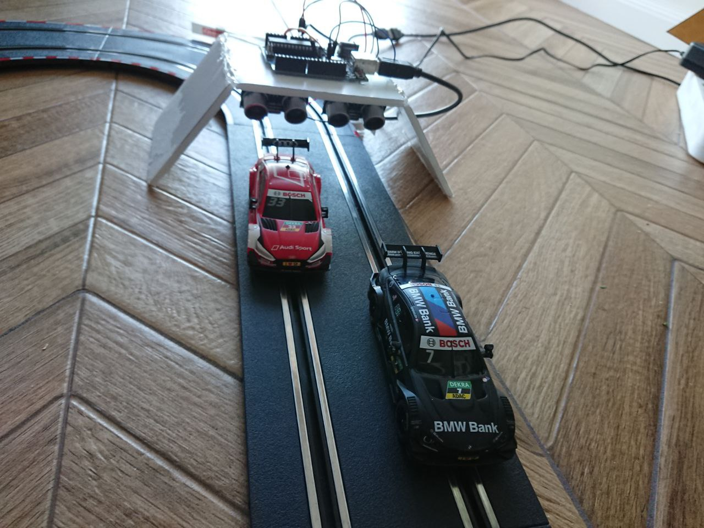
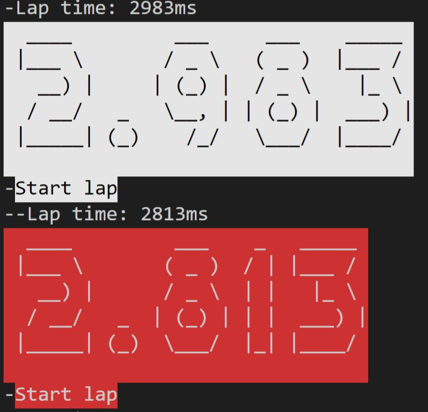

# RC laptimer

A simple laptimer made with components on hand, 2 HC-SR04 proximity sensors. They are not quite accurate or precice, but they do their job. Measuring the cars passed on a Carrera go track that i got for my birthday.

```
#Clone the project
npm install
#Install interchange 
npm install nodebots-interchange -g
#Connect arduino
#Install firmata firmware
interchange install hc-sr04 -a uno -p COM4 --firmata

#Run the program
npm start

#Race!
```

